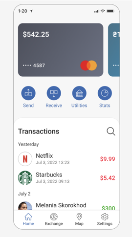

# wallet-app

We are going to recreate this view:



## Requirements
    Node v18

## How to run the project

1. run `npm install`

2. run `npm run start`

## Project Structure

src
 - **app** _root folder_
   - **bottom-navigation** _actions to move inside the wallet_
   - **home** _initial view_
     - **actions** _buttons for actions in home view_
     - **card-carousel** _cards for users_
     - **transactions** _all user movements_
       - **model** _all data model for transactions_
       - **service** _communication with the backend_
       - **view** _all related with the user view_

The idea is to have the structure like transactions. If we are going to have in a micro-frontend architecture, we can divide every bottom navigation in a different frontend so we can deploy in parallel.

## What have left:
* I have replaced the card section with a carousel. This is a matter that I may discuss further with the UI team. If they do not agree with the change, I am open to moving it according to their preference.
* All bottom-navigation actions are going to be separate module, so we can do a lazy loading.
* The actions for home should change the view of the home, we have to include the route for them
* The calculation of the panel's responsive height for transactions is pending (if whe have more transaction we should see an scroll to see them instead of the page scroll), as it was estimated to require more than 4 hours. One proposed approach for this task involves calculating the height and setting it using the following code:
```typescript
  const contentElement = this.elementRef.nativeElement;
  const windowHeight = window.innerHeight;
  const maxHeight = windowHeight - footerHeight;
  contentElement.style.maxHeight = `${maxHeight}px`;
```
